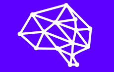

# Awesome Ascii

<p align="center"><a href="https://brainstack.net/"></a></p>
<p align="center">This project is powered by <a href="https://brainstack.net/">Brainstack</a></p>

# About

Awesome Ascii is a command-line interface (CLI) tool designed to transform images into ASCII text art.
It processes an input image by scaling, converting it to grayscale, and then mapping the pixel values to ASCII characters.
The resulting ASCII art can be output directly to the terminal or saved to a file.
The command also allows for adjusting the concurrency level to optimize performance.

# Example

This is a basic example on how to convert an image to Ascii

```
go run main.go -i images/darkness.png -a contrast -w 150
```

---

- ### Before



- ### After


This is a list of Flags you can use to manipulate the output:

```
Flags:
  -a, --ascii-type AsciiCharType   Determine which set of ascii characters will be used (default basic)
  -C, --color                      Select if the image should be colored or not
  -c, --concurrency int            Set GOMAXPROCS (default max CPU cors)
  -h, --help                       help for awesome-ascii
  -i, --input string               An image path which will be converted to ASCII
  -o, --output string              An output path for the converted image
  -v, --version                    version for awesome-ascii
  -w, --width uint16               An image path which will be converted to ASCII (default terminal size)
```

You can also choose which characters pool to use for conversion, this is the list of Ascii characters supported

- basic (@%#\*+=-:. )
- binary (01)
- contrast (@#S%?\*+;:,. )
- extended (@W#98B0%Zq6x2t!i\*|~-:. )
- high detail (@$B%8&WM#\*oahkbdpqwmZO0QLCJUYXzcvunxrjft/|()1{}[]?-\*+~<>i!lI;:,\"^`'. )

---

You can achieve the same output in an interactive way, you just need to type the command below to open interactive CLI

```
go run main.go interactive
```

Running the following command will open the CLI in interactive mode


# Sobel

a command-line interface (CLI) command to process images using the Sobel edge detection algorithm.

This command reads an input image, scales it to the desired width, converts it to grayscale, and then applies the Sobel algorithm to highlight the edges.

The resulting edge-detected image is then transformed into ASCII art.
Users can choose to display the ASCII art directly in the terminal or save it to a file.

# Example

This is a basic example on how to convert a image to Ascii art using sobel

```
go run main.go sobel -t 100  -i images/brainstack.png   -w 100
```

---

- ### Result


You can find here the list of flags to manipulate the output of a Sobel image

```
Flags:
  -a, --ascii-type AsciiCharType   Determine which set of ascii characters will be used (default basic)
  -h, --help                       help for sobel
  -i, --input string               An image path which will be converted to ASCII
  -o, --output string              An output path for the converted image
  -t, --threshold uint8            Threshold between 0..255 to control intensity of assci in the edges of the image (default 130)
  -w, --width uint16               An image path which will be converted to ASCII (default terminal size)
```

# Colored

This mode generates the images in colored mode, in which the user only have to choose what character to replace pixels with

# Example

This is a basic example on how to convert a image to colored Ascii art

```
go run main.go colored -i .\images\brainstack.png -w 100
```

---

- ### Result


You can find here the list of flags to manipulate the output of a colored image

```
Flags:
  -H, --char string    An image path which will be converted to ASCII (default "#")
  -h, --help           help for colored
  -i, --input string   An image path which will be converted to ASCII
  -w, --width uint16   An image path which will be converted to ASCII (default terminal size)
```
